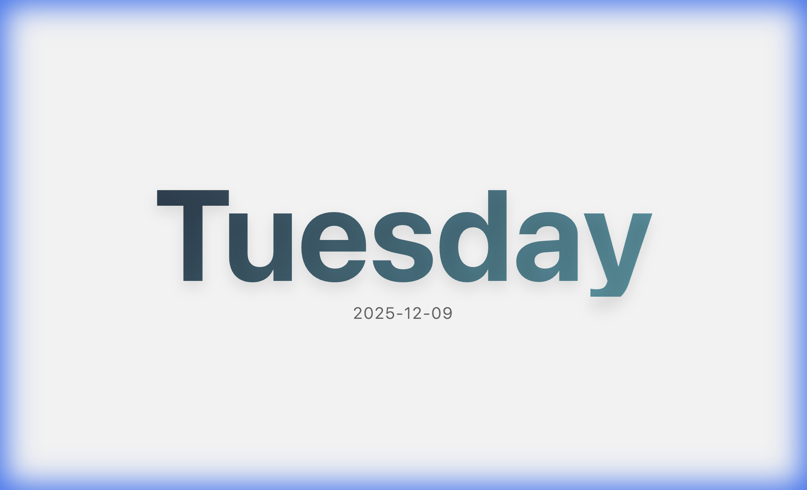
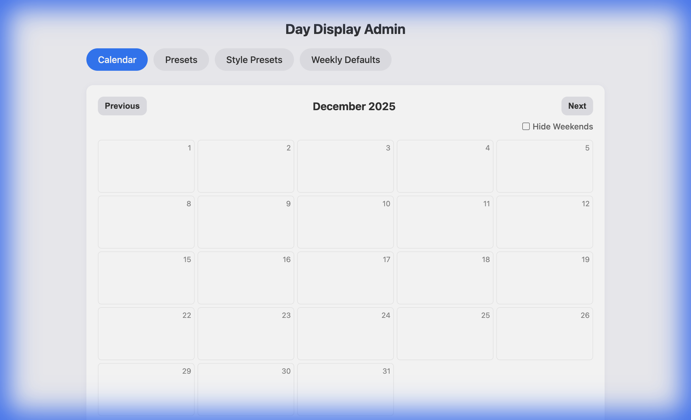
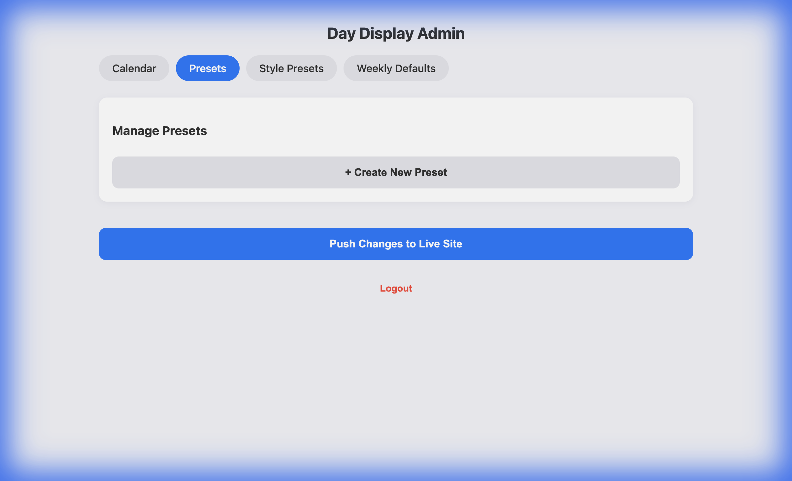
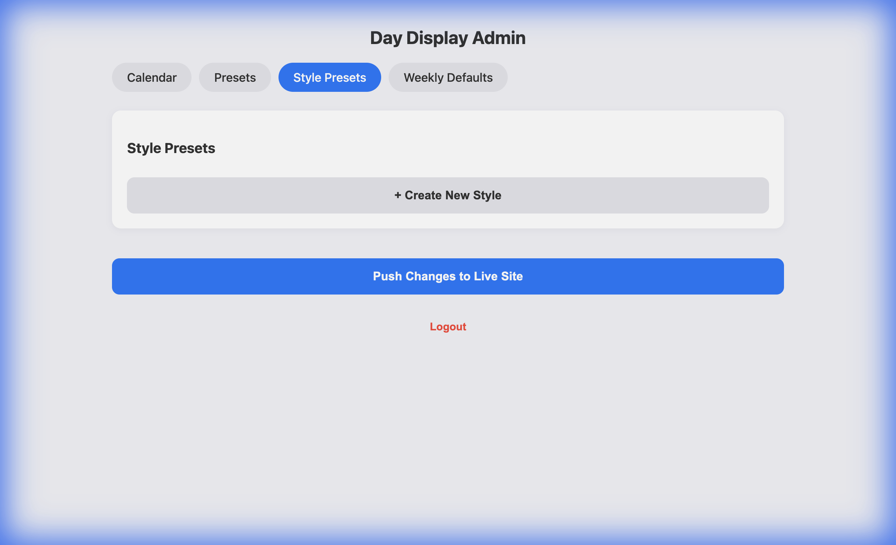

# Classroomscreen Day Display Widget

A specialized tool for teachers to display day-specific schedules, messages, and themes on their classroom screen or website.

## What is this?

This is a **custom widget** that you can embed into [Classroomscreen](https://classroomscreen.com/) (or any website). It allows you to:

* Show a different message or schedule for each day (e.g., "Monday: Library", "Tuesday: Art").
* Use beautiful, color-coded themes.
* Manage everything from an easy-to-use **Admin Dashboard** (no coding required after setup!).



---

## 🚀 Setup Guide (For Teachers)

You can have your own version of this up and running in about 10 minutes. You do **not** need to know how to code.

### Step 1: Create your own copy

1. **Sign up** for a free [GitHub account](https://github.com/signup) if you don't have one.
2. **Fork** this repository:
    * Look at the top-right corner of this page.
    * Click the **Fork** button.
    * Click **Create Fork**.

### Step 2: Turn on the Website

1. On your new repository page, click **Settings** (top menu bar).
2. On the left sidebar, click **Pages**.
3. Under **Build and deployment** > **Branch**, select `main` from the dropdown menu.
4. Click **Save**.
5. Wait about 1-2 minutes. Refresh the page until you see a bar at the top saying:
    > "Your site is live at `https://<your-username>.github.io/classroomscreen-day-display/`"
6. **Copy this link**. this is your **Widget URL**.

---

## ⚙️ How to Manage Your Schedule

You don't need to edit code to change your schedule. You use the **Admin Dashboard**.

### 1. Get your "Admin Key" (One-time setup)

To save changes securely, you need a password called a "Personal Access Token".

1. Go to [GitHub Token Settings](https://github.com/settings/tokens?type=beta).
2. Click **Generate new token**.
3. **Name**: "Classroomscreen".
4. **Expiration**: Set to "No expiration" (or 1 year).
5. **Repository access**: Select "All repositories" (or just this one).
6. **Permissions**:
    * Click "Repository permissions".
    * Scroll to **Contents**. Change "Access" to **Read and write**.
7. Click **Generate token**.
8. **COPY THE LONG CODE IMMEDIATELY**. You won't see it again.

### 2. Open the Admin Dashboard

1. Take your **Widget URL** (from Step 2) and add `/admin.html` to the end.
    * Example: `https://<your-username>.github.io/classroomscreen-day-display/admin.html`
2. Paste your **Token** into the login box.
3. You're in! You can now:
    * **Edit Rules**: Set what happens on "Mondays" vs "Tuesdays".
    * **Calendar**: Click specific days to override the rule (e.g., "Field Day" on specific Friday).
    * **Styles**: Create new color themes.

    

    * **Presets**: Manage your reusable messages.

    

    * **Styles**: Create custom beautiful themes.

    

---

## 🖥️ How to use in Classroomscreen

1. Open [Classroomscreen](https://classroomscreen.com/).
2. Click **More Widgets** (the 3 dots).
3. Select **Embed** (the `</>` icon).
4. Paste the following code into the box, but **REPLACE** the link with your **Widget URL**:

```html
<iframe 
    src="https://<your-username>.github.io/classroomscreen-day-display/"
    style="border:none; width:100%; height:100%;"
    title="Day Display">
</iframe>
```

1. Resize the widget as needed. It will automatically update every day based on your settings!

---

## Advanced Features

* **Hide Weekends**: In the Admin Dashboard, check "Hide Weekends" to simplify the view.
* **Recurring Events**: You can schedule an event to repeat "Every 4 Days" (great for rotating block schedules).
* **Style Overrides**: When scheduling a day, you can pick a specific style (e.g., "Urgent Red") just for that one event.

---

### Troubleshooting

* **"Save Failed"**: Your Token might not have "Contents: Read and write" permission. Generate a new one.
* **Changes don't show up immediately**: GitHub Pages takes about 30-60 seconds to update after you save. Just wait a moment and refresh.
